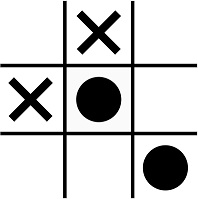

<p align="center">
  
</p>


# Unbeatable Tic-Tac-Toe

The game is built using the Minimax algorithm which is a backtracking algorithm. The system computes all possible future variations of the board and selects the best move to play based on a score. 


### Build and Run

------

Compile using GCC or other C compiler and run

```shell
$ gcc -O3 main.c && ./a
```


### References

------

- [TowardsDataScience](https://towardsdatascience.com/tic-tac-toe-creating-unbeatable-ai-with-minimax-algorithm-8af9e52c1e7d#:~:text=Minimax%20algorithm,minimize%20the%20worst%20case%20scenario)
- [GeeksForGeeks](https://www.geeksforgeeks.org/minimax-algorithm-in-game-theory-set-1-introduction/)
- [The Coding Train](https://www.youtube.com/watch?v=trKjYdBASyQ)
- [Sebastian Lague](https://www.youtube.com/watch?v=l-hh51ncgDI) [Highly Recommended]